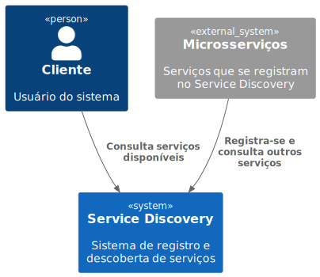
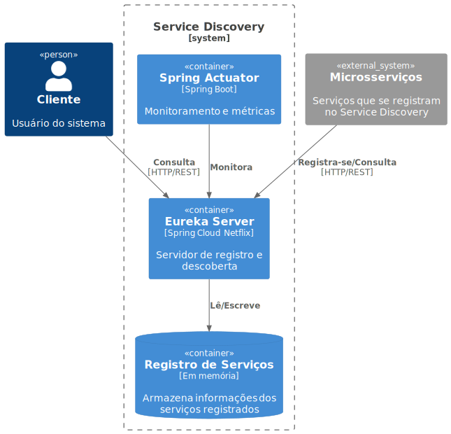
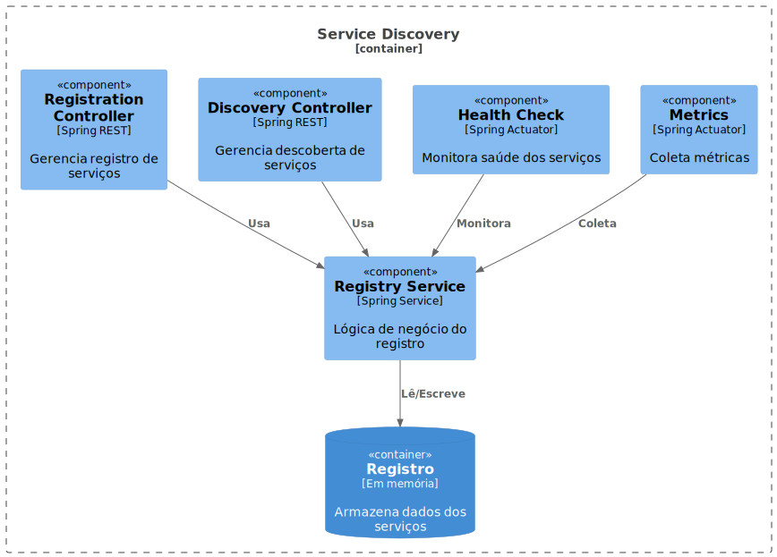

# Service Discovery

<p align="center">
  
</p>

## 📋 Sobre o Projeto

Service Discovery é um componente central da nossa arquitetura de microsserviços, responsável pelo registro e descoberta dinâmica de serviços. Implementado usando Spring Cloud Netflix Eureka, oferece uma solução robusta para gerenciamento de registro e localização de serviços distribuídos.

## 🏗️ Arquitetura

### Visão Geral do Sistema


### Componentes Principais


Para mais detalhes sobre a arquitetura, consulte nossa [documentação detalhada](docs/architecture/c4model/README.md).

## 🚀 Tecnologias Utilizadas

- Java 17
- Spring Boot 3.3.4
- Spring Cloud Netflix Eureka
- Spring Actuator
- Maven
- Docker/Jib

## 📦 Pré-requisitos

- Java 17+
- Maven 3.6+
- Docker (opcional)

## 🛠️ Configuração e Instalação

1. Clone o repositório:
```bash
git clone https://github.com/thiagoporb/service-discovery.git
cd service-discovery
```

2. Compile o projeto:
```bash
mvn clean package
```

3. Execute localmente:
```bash
java -jar target/service-discovery.jar
```

### 🐳 Usando Docker

1. Construa a imagem:
```bash
mvn clean package jib:build
```

2. Execute o container:
```bash
docker run -p 8761:8761 service-discovery:latest
```

## ⚙️ Configuração

### Portas
- Padrão: 8761

### Principais Endpoints
- Dashboard Eureka: `http://localhost:8761`
- Registro de Serviços: `http://localhost:8761/eureka/apps`
- Health Check: `http://localhost:8761/actuator/health`
- Métricas: `http://localhost:8761/actuator/metrics`

### Configuração do application.yml
```yaml
server:
  port: 8761

eureka:
  client:
    registerWithEureka: false
    fetchRegistry: false
```

## 📈 Monitoramento

O Service Discovery inclui endpoints do Spring Actuator para monitoramento:

- Health Check: `/actuator/health`
- Métricas: `/actuator/metrics`
- Info: `/actuator/info`

## 🔒 Segurança

Por padrão, o Eureka Server não possui autenticação habilitada. Para ambientes de produção, recomenda-se:

1. Habilitar Spring Security
2. Configurar HTTPS
3. Implementar autenticação básica ou OAuth2

## 🌐 Integração

### Exemplo de Cliente Eureka

```yaml
eureka:
  client:
    serviceUrl:
      defaultZone: http://localhost:8761/eureka/
  instance:
    preferIpAddress: true
```

## 🧪 Testes

Execute os testes usando:

```bash
mvn test
```

## 📊 Métricas e Dashboards

- Eureka Dashboard: `http://localhost:8761`
- Métricas Prometheus: `http://localhost:8761/actuator/prometheus`
- Health Check: `http://localhost:8761/actuator/health`

## 🚀 CI/CD

O projeto utiliza GitHub Actions para:
- Compilação automática
- Execução de testes
- Geração de documentação
- Build e push de imagem Docker

## 📚 Documentação Adicional

- [Documentação Técnica Detalhada](docs/architecture/README.md)
- [Guia de Contribuição](CONTRIBUTING.md)
- [Registro de Alterações](CHANGELOG.md)
- [Decisões de Arquitetura](docs/architecture/decisions/adr/)

## 🤝 Contribuindo

1. Fork o projeto
2. Crie sua branch de feature (`git checkout -b feature/AmazingFeature`)
3. Commit suas mudanças (`git commit -m 'Add some AmazingFeature'`)
4. Push para a branch (`git push origin feature/AmazingFeature`)
5. Abra um Pull Request

## 📄 Licença

Este projeto está sob a licença MIT - veja o arquivo [LICENSE.md](LICENSE.md) para detalhes.

## ✨ Autores

- **José Thiago Tenório Lopes** - *Trabalho inicial* - [thiagoporb](https://github.com/thiagoporb)

## 🙏 Agradecimentos

- Spring Cloud Team
- Netflix Eureka Team
- Todos os contribuidores que participaram deste projeto

## 📞 Suporte

Para suporte, envie um email para thiagoporb@hotmail.com ou abra uma issue no repositório.

---
⌨️ com ❤️ por [José Thiago](https://github.com/thiagoporb) 😊